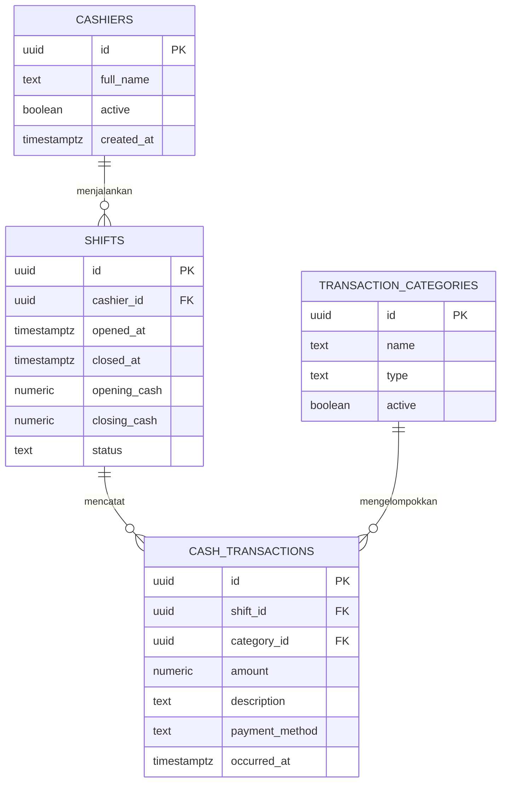

# Arus Kas SPBU

Dashboard kas operasional dengan frontend HTML/CSS/JavaScript statis. Frontend terhubung langsung ke Supabase Auth dan Postgres menggunakan publishable key serta RLS, sehingga dapat di-host di GitHub Pages. Tidak ada `package.json` atau `env.example`.

## Struktur

```text
frontend/
  index.html
  styles.css
  app.js
backend/
  app.js
  schema.sql
.gitignore
README.md
```

## ERD



## Konfigurasi Supabase

1. Jalankan seluruh isi `backend/schema.sql` di Supabase **SQL Editor**. Ini menyiapkan empat tabel dan policy RLS untuk role `authenticated`.
2. Di awal `frontend/app.js`, ganti placeholder berikut dengan URL dan **publishable key** dari project Supabase:

```js
const SUPABASE_URL = 'https://PROJECT_REF.supabase.co';
const SUPABASE_PUBLISHABLE_KEY = 'sb_publishable_...';
```

Ambil nilai tersebut dari **Project Settings → API**. Publishable key memang dipakai di browser; RLS membatasi akses data. **Jangan pernah** memasukkan service role/secret key ke frontend.

3. Tambahkan akun operator di **Authentication → Users → Add user**. Konfirmasi email jika project mewajibkannya.

## GitHub Pages

1. Push repository tanpa file `.env`.
2. Buka repository **Settings → Pages**.
3. Pilih **Deploy from a branch**, branch `main`, lalu folder `/frontend` sebagai sumber.
4. Tambahkan URL situs GitHub Pages pada **Supabase → Authentication → URL Configuration → Redirect URLs** bila diperlukan untuk alur Auth project.

Setelah publish key diisi dan RLS SQL dijalankan ulang, buka URL Pages untuk login. GitHub Pages dapat melayani frontend statis, tetapi tidak menjalankan `backend/app.js`.

## Lokal

Untuk menguji dengan server statis bawaan Node:

```powershell
node backend/app.js
```

Buka `http://localhost:3000`. Operasi frontend menggunakan Supabase langsung; server lokal hanya menyajikan file statis.

## Fitur

- Ringkasan pemasukan dan pengeluaran tunai, saldo shift, serta jumlah transaksi.
- Grafik arus kas 7 atau 14 hari dan komposisi pemasukan/pengeluaran.
- Pencatatan transaksi tunai, transfer, atau kartu/QRIS, dengan kategori sesuai jenisnya.
- Pembukaan dan penutupan shift serta pencatatan saldo kas fisik saat tutup.
- Pencarian dan filter transaksi.

Hari operasional dan agregasi grafik menggunakan tanggal UTC. Library Supabase JS v2 dimuat dari jsDelivr CDN.
