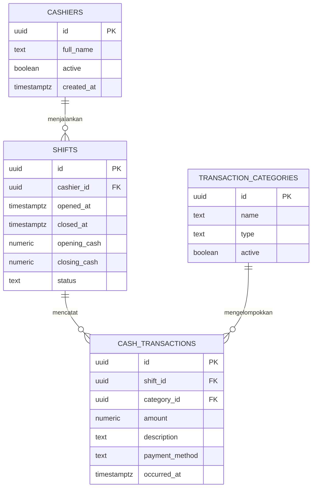

# Arus Kas SPBU

Dashboard kas operasional dengan frontend HTML/CSS/JavaScript dan backend Node.js bawaan. Data disimpan di Supabase Postgres. Tidak ada `package.json` atau `env.example`; backend tidak membutuhkan paket npm tambahan.

## Struktur

```text
frontend/
  index.html
  styles.css
  app.js
backend/
  app.js
  schema.sql
.gitignore
README.md
```

## ERD



## Menjalankan

1. Buat project Supabase, lalu jalankan seluruh isi `backend/schema.sql` di **SQL Editor**. SQL tersebut membuat empat tabel inti sekaligus kategori dan satu kasir awal.
2. Pasang Node.js 18 atau lebih baru.
3. Isi `backend/.env` dengan URL dan **anon/publishable key** dari project Supabase. Backend juga mendukung `.env` di root; bila kedua file ada, file root yang digunakan.

```dotenv
SUPABASE_URL=https://PROJECT_REF.supabase.co
SUPABASE_ANON_KEY=ANON_ATAU_PUBLISHABLE_KEY
PORT=3000
```

Ambil URL dan anon/publishable key dari **Project Settings → API**. Aplikasi menggunakan sesi akun operator untuk mengakses database melalui RLS, sehingga service role key tidak diperlukan.

4. Dari terminal di folder project, jalankan server:

```powershell
node backend/app.js
```

5. Buka `http://localhost:3000`. Jika server sudah berjalan sebelum `.env` diisi, hentikan dan jalankan ulang agar konfigurasi baru dimuat.

Tambahkan akun operator melalui **Authentication → Users → Add user** di Supabase, lalu masuk dengan email dan password akun tersebut. Aplikasi tidak menyediakan pendaftaran publik. Jalankan ulang `backend/schema.sql` setelah perubahan kebijakan RLS ini supaya pengguna `authenticated` mendapat hak akses yang diperlukan. Sesi aplikasi memakai cookie HttpOnly; endpoint data menolak permintaan tanpa sesi. `.env` sudah masuk `.gitignore`.

## Fitur

- Ringkasan pemasukan dan pengeluaran tunai, saldo shift, serta jumlah transaksi.
- Grafik arus kas 7 atau 14 hari dan komposisi pemasukan/pengeluaran.
- Pencatatan transaksi tunai, transfer, atau kartu/QRIS, dengan kategori sesuai jenisnya.
- Pembukaan dan penutupan shift serta pencatatan saldo kas fisik saat tutup.
- Pencarian dan filter transaksi.

Hari operasional dan agregasi grafik menggunakan tanggal UTC. Backend berjalan dengan modul bawaan Node.js (`http`, `fs`, dan `fetch`) sehingga tidak perlu instalasi dependensi.
